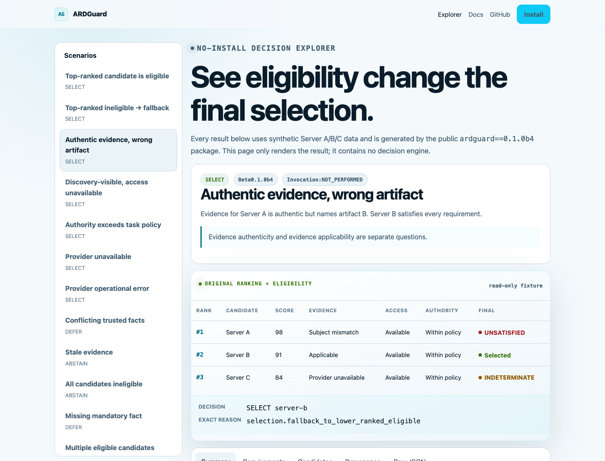

# ARDGuard

[](https://pypi.org/project/ardguard/)
[](https://doi.org/10.5281/zenodo.22691550)
[](https://github.com/lokesh0186/ardguard/actions/workflows/python-compat.yml)
[](https://pypi.org/project/ardguard/)
[](LICENSE)

**ARDGuard adds task-specific eligibility and safe fallback between agentic resource discovery and invocation.**

Discovery ranks resources by relevance. ARDGuard checks which resources are actually
eligible for this task and selects the highest-ranked eligible candidate, or fails
closed. It never installs or invokes the selected resource.

[Try the no-install Decision Explorer](https://lokesh0186.github.io/ardguard/explorer/)
· [Read the docs](https://lokesh0186.github.io/ardguard/docs/)

## Try it in 60 seconds

```bash
python -m pip install ardguard
ardguard demo
```

```text
ARDGuard offline demo (illustrative)
rank 1: relevant but capability-ineligible
rank 2: eligible
top-ranked-only validation: ABSTAIN
ARDGuard: SELECT urn:air:example.org:tool:rank-two
reason: selection.fallback_to_lower_ranked_eligible
invocation: NOT PERFORMED
```

Or see the canonical three-candidate decision in your browser:

> The Explorer uses synthetic candidates and facts. Production candidate names,
> scores, policies, and DecisionReceipts remain with the operator and should not be
> published without review and appropriate redaction.

| Rank | Candidate | Evidence | Access | Authority | Final |
| ---: | --- | --- | --- | --- | --- |
| #1 | Server A | authentic, wrong artifact | available | within policy | **INELIGIBLE** |
| #2 | Server B | valid and applicable | available | within policy | **SELECTED** |
| #3 | Server C | provider unavailable | unknown | within policy | **INDETERMINATE** |

ARDGuard did not rerank the candidates. It preserved discovery order and selected
Server B, the highest-ranked candidate that satisfied every mandatory requirement.



> **Status:** public `0.1.0b4`. The deterministic v1 path is supported. The
> extensible v2 kernel and protocol packs are experimental. Check the
> [support matrix](docs/SUPPORTED_SCOPE.md) before production use.

## Where it sits

```text
ARD-compatible discovery backend
              |
              v
       ranked candidates
              |
              v
          ARDGuard
  facts + policy + fallback
              |
              v
 SELECT / DEFER / ABSTAIN / ERROR
              |
              v
      caller owns invocation
```

Relevance answers **which resource looks useful**. Eligibility answers **which resource
may this agent use for this task**. ARDGuard does not replace ARD, hf-discover, MCP,
relevance ranking, Sigstore, OAuth, runtime authorization, or Kubernetes RBAC.

## JSON in, decision JSON out

Prepare a task contract, policy, and observations, then evaluate any supported ARD
SearchResponse:

```bash
hf-discover search "read customer records" --json > discovery.json

ardguard evaluate \
  --adapter hf-discover \
  --discovery-response discovery.json \
  --task task.json \
  --policy policy.json \
  --facts facts.json \
  --output decision.json

ardguard explain decision.json
```

Example decision:

```json
{
  "outcome": "SELECT",
  "reason": "selection.fallback_to_lower_ranked_eligible",
  "selected_candidate_id": "urn:air:example.org:tool:rank-two",
  "selected_rank": 2
}
```

The actual decision document also contains every candidate verdict, stable reason
codes, provider identities, preserved backend scores, and a deterministic body hash.

## Python integration

```python
from ardguard import FactSet, Policy, TaskContract, evaluate
from ardguard.adapters import parse_search_response

candidates = parse_search_response(discovery_response)
decision = evaluate(
    candidates=candidates,
    task=TaskContract.from_mapping(task_document),
    policy=Policy.from_mapping(policy_document),
    facts=FactSet.from_mapping(fact_document),
)

if decision.outcome.value == "SELECT":
    # The caller may now decide whether and how to invoke the resource.
    print(decision.selected_candidate_id)
```

## Why fallback matters

A top-ranked-only validator can reject an ineligible first result, but it also abandons
the task when a lower-ranked candidate is eligible. ARDGuard evaluates the configured
candidate set, preserves the backend's rank among eligible candidates, and returns the
highest-ranked eligible candidate. It does not manufacture or reinterpret relevance
scores.

## Contracts, not self-asserted eligibility

Public callers supply observations, not `eligible: true`. ARDGuard derives candidate
verdicts from versioned contracts:

- `TaskContract` states required operations, evidence, and authority limits.
- `FactSet` binds typed observations to candidate and provider identities.
- `Policy` controls required checks, uncertainty, and fallback.
- `Decision` reports `SELECT`, `DEFER`, `ABSTAIN`, or `ERROR` with stable reasons.

Missing facts, unavailable verifiers, and operational errors fail closed. An
operational verifier failure is never reported as an invalid signature. Authentic
evidence for artifact A never makes candidate B eligible.

## Commands

| Command | Purpose |
| --- | --- |
| `ardguard demo` | Run the deterministic offline fallback example. |
| `ardguard doctor` | Report package, schema, adapter, and provider readiness. |
| `ardguard validate` | Validate task, fact, policy, decision, ARD, or hf-discover JSON. |
| `ardguard evaluate` | Produce a deterministic decision without invocation. |
| `ardguard explain` | Validate the decision hash and explain its reason. |
| `ardguard support` | Print the tested support matrix. |
| `ardguard adapters` | Print exact adapter compatibility records. |
| `ardguard providers list` | Describe provider and policy-pack extension boundaries. |
| `ardguard serve` | Run the experimental loopback-only JSON decision service. |

## Extensible kernel

Beta 3 includes an experimental v2 kernel for third-party fact types, typed
requirements, decision receipts, stdin/stdout integration, and a loopback HTTP API.
Beta 2 v1 contracts remain unchanged. Start with the existing commands above;
advanced integrators can read the [extensibility guide](docs/EXTENSIBILITY.md) and
[eligibility-pack matrix](docs/ELIGIBILITY_PACKS.md).

## Documentation

- [Public documentation and Decision Explorer](https://lokesh0186.github.io/ardguard/)
- [Five-minute integration guide](docs/INTEGRATION_GUIDE.md)
- [Architecture](docs/ARCHITECTURE.md)
- [Security model](docs/SECURITY_MODEL.md)
- [Supported scope](docs/SUPPORTED_SCOPE.md)
- [Decision and reason codes](docs/DECISIONS.md)
- [Fact providers](docs/FACT_PROVIDERS.md)
- [Build a third-party provider](docs/BUILD_A_PROVIDER.md)
- [Extensible kernel](docs/EXTENSIBILITY.md)
- [Eligibility packs](docs/ELIGIBILITY_PACKS.md)
- [ARD v0.91 compatibility](docs/ARD_COMPATIBILITY.md)
- [hf-discover integration](docs/HF_DISCOVER.md)
- [Evidence](docs/EVIDENCE.md)
- [Authority policy](docs/AUTHORITY.md)

## Examples

- [Basic capability decision](examples/basic/README.md)
- [Rank-preserving fallback](examples/fallback/README.md)
- [Authentic but non-applicable evidence](examples/evidence/README.md)
- [Authority-aware fallback](examples/authority/README.md)
- [ARD v0.91 SearchResponse](examples/ard_search_response/README.md)
- [Pinned hf-discover response](examples/hf_discover/search-response-1.3.7.json)
- [Semantic Kernel community interoperability example](examples/integrations/semantic-kernel/README.md)
- [Third-party region provider](examples/provider_plugin/README.md)

## Development

```bash
python3.12 -m venv .venv
.venv/bin/pip install -e '.[dev]'
.venv/bin/pytest
.venv/bin/ruff check .
.venv/bin/mypy src/ardguard
```

Small compatibility fixtures, provider implementations, reason-code improvements,
and reproducible interoperability reports are welcome. Read [CONTRIBUTING.md](CONTRIBUTING.md)
and [SECURITY.md](SECURITY.md) first.

## License

Apache License 2.0. See [LICENSE](LICENSE) and [NOTICE](NOTICE).
